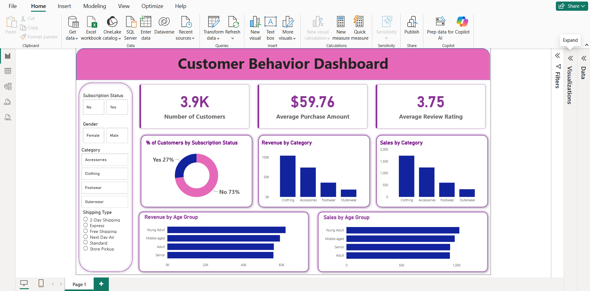

# 🛍️ Retail Customer Behavior & Insight Pipeline
**Tools Used:** Python (Pandas, Seaborn), MySQL, Power BI, DAX.

## 📌 Project Overview
This project is an end-to-end data pipeline designed to analyze 3,900+ retail transactions. I used Python for heavy data cleaning and **MySQL** for relational data modeling and complex business querying.

## 📸 Executive Dashboard Preview

## 🛠️ Data Lifecycle & Technical Steps

### 1. Data Cleaning & Preprocessing (Python)
* **Standardization:** Renamed 20+ columns to `snake_case` for programmatic consistency.
* **Missing Value Imputation:** Handled null values in the `review_rating` column using **Category-Based Median Imputation** (MySQL-style logic) to ensure data accuracy.
* **Feature Engineering:** Segmented customers into `age_groups` and `spending_tiers` to identify high-value demographics.

### 2. Database Management (MySQL)
* **Relational Modeling:** Established a schema to store cleaned retail data.
* **Advanced Querying:** Wrote MySQL scripts to calculate **Revenue Market Share** and identify "Power Users" (customers with >10 previous purchases).
* **Portable Implementation:** For the purpose of this GitHub repository, an SQLite engine was used to provide a portable version of the MySQL database logic.

### 3. Visual Analytics (Power BI)
* **KPI Metrics:** Developed measures for **YoY Growth**, **Average Order Value (AOV)**, and **Profit Margin %**.
* **Interactivity:** Integrated multi-select slicers to allow stakeholders to drill down into specific market trends by Region and Category.

## 📈 Key Insights
* **Target Audience:** The "Adult" (30-50) segment contributes the highest revenue volume.
* **Category Performance:** "Clothing" is the dominant revenue driver across all regions.
* **Payment Trends:** High-value customers show a strong preference for digital wallets over cash.
